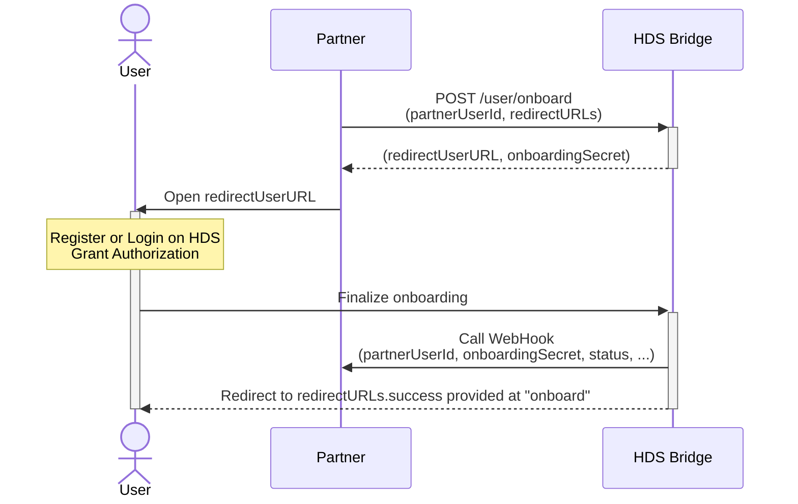

# lib-bridge-js

Library for building HDS partner bridges — machine-to-machine services that handle user onboarding and data synchronization between partner platforms and [Health Data Safe](https://github.com/healthdatasafe).

Each bridge is a standalone app that depends on this library. See [bridge-chartneo](https://github.com/healthdatasafe/bridge-chartneo) for a real-world example.

## What it provides

- Express server with clustering, CORS, JSON parsing, error handling
- Partner authentication middleware (`partnerAuthToken` header check)
- User onboarding flow (initiate → HDS auth → finalize → webhook)
- Bridge account management (user credentials, sync status, error logging)
- `PluginBridge` base class for partner-specific logic
- Test utilities for consumer repos

## Public API

```typescript
import {
  PluginBridge,        // Base class — extend this for your bridge
  startCluster,        // Entry point with clustering
  createBridgeApp,     // Express app factory
  initBoiler,          // Config initialization (accepts consumer configDir)
  errors,              // Error helpers (assertFromPartner, badRequest, etc.)
  Router,              // express-promise-router
  initHDSModel,        // HDS data model init (re-exported from hds-lib)
  getHDSModel,         // HDS data model access (re-exported from hds-lib)
  ensureAppStreamsTree,// Provision a {appId}-app/ subtree on a user account (Plan 25 / Plan 45 §9)
  testServer           // Test helpers (init, apiTest, createOnboardedUser, etc.)
} from 'lib-bridge-js';
```

### App-stream subtree (`ensureAppStreamsTree`)

Bridges should publish their app-specific content (notes, messaging, …) under a stable `{appId}-app/` subtree per the Plan-25 convention. Use the helper rather than rolling your own `streams.create` boilerplate:

```typescript
import { ensureAppStreamsTree } from 'lib-bridge-js';

const { appStreamId, subStreamIds } = await ensureAppStreamsTree(hdsConnection, {
  appId: 'my-bridge',
  baseName: 'My Bridge App',
  parentId: 'my-bridge',                            // optional: child of an existing base
  subStreams: [
    { suffix: 'notes', name: 'Notes' },             // → my-bridge-app-notes
    { suffix: 'chat',  name: 'Chat',                // → my-bridge-app-chat
      clientData: { hdsCustomField: { /* … */ } }   // optional clientData per substream
    }
  ]
});
// Use appStreamId on the bridge access via appTemplates.ensureBridgeAccess({ clientData: { appStreamId } })
```

Idempotent (tolerates `item-already-exists`).

## Creating a bridge

### 1. Define your bridge class

```typescript
// src/index.ts
import { PluginBridge } from 'lib-bridge-js';
import type { Application } from 'express';

export default class MyBridge extends PluginBridge {
  override get key () { return 'my-bridge'; }

  override get potentialCreatedItemKeys () {
    return ['body-weight']; // HDS item keys this bridge creates
  }

  override async init (app: Application, bridgeConnectionGetter: () => unknown) {
    await super.init(app, bridgeConnectionGetter);
    // Load routes, initialize singletons
    app.use('/data/', myDataRoute);
  }

  override async newUserAssociated (partnerUserId: string, apiEndPoint: string) {
    // Called when a user completes onboarding
    return { status: 'ok' };
  }
}
```

### 2. Create the entry point

```typescript
// src/start.ts
import { startCluster } from 'lib-bridge-js';
import MyBridge from './index.ts';
startCluster(new MyBridge(), import.meta.dirname + '/../config');
```

### 3. package.json

```json
{
  "dependencies": {
    "lib-bridge-js": "git+https://github.com/healthdatasafe/lib-bridge-js.git"
  },
  "scripts": {
    "start": "node --experimental-strip-types src/start.ts",
    "setup:dev": "npm install && cd node_modules/lib-bridge-js && npm install"
  }
}
```

The bridge's only dependency is `lib-bridge-js` — all other packages (express, hds-lib, boiler, etc.) come transitively. `setup:dev` installs lib-bridge-js's devDependencies (mocha, supertest, etc.) for testing.

### 4. Configuration

Provide a `config/` directory with:
- `default-config.yml` — framework defaults + bridge-specific defaults (service config, permissions, etc.)
- `test-config.yml` — test overrides (unsafe token, localhost, disabled logs)
- `localConfig.yml` — minimal, just deployment secrets (`bridgeApiEndPoint`)

In production (Dokku), secrets come from environment variables — no mounted config files needed.

## Bridge API

### Authorization

All API calls require the `Authorization` header with the value set in `partnerAuthToken`.

### `POST /user/onboard`

Initiate user onboarding.

**@body**
- `partnerUserId`: {string}
- `redirectURLs`: {Object} — `success`, `cancel` URLs
- `clientData`: {Object} — key-value pairs sent back via webhook

**@returns** — either `authRequest` (new user) or `userExists` (already onboarded)

### Onboarding flow



Detailed flow: [doc/onboarding-flow-detail.md](./doc/onboarding-flow-detail.md)

### `GET /user/{partnerUserId}/status`

Returns user status, credentials, and sync status. 404 if not found.

### `POST /user/{partnerUserId}/status`

Change the `active` status of a user. Body: `{ "active": true|false }`.

### `GET /account/errors/`

Retrieve error log from the bridge account. Query params: `limit`, `fromTime`, `toTime`.

### Webhook

The partner webhook is called on onboarding success, cancel, or error. Configured via `partnerURLs.webhookOnboard` (url, method, headers).

Parameters sent: `type` (SUCCESS/CANCEL/ERROR), `partnerUserId`, `onboardingSecret`, `clientData` values, `pluginResultJSON` (on success).

## Storage

The bridge uses a dedicated HDS account for storage. Under the root stream (`service.bridgeAccountMainStreamId`, default "bridge"):
- `bridge-users` → `bridge-user-{partnerUserId}` — per-user credentials and auth requests
- `bridge-users-active` — tags active user credentials
- `bridge-errors` — onboarding error log

## Prerequisites

- Node.js >= 22.6.0
- npm >= 9.6.5

## Setup

```bash
npm run setup            # Install dependencies + HDS setup
npm run setup-dev-env    # Dev environment (test HDS account)
```

Edit `localConfig.yml` — see `config/sample-localConfig.yml` for reference.

## Development

```bash
npm test                 # Run tests
npm test -- --grep=PLTX  # Run specific tests
npm run test:coverage    # Coverage report
npm run lint             # Lint
```

The test suite includes `SampleBridge` in `tests/sample-bridge/` — a minimal bridge that demonstrates how to use the library. It follows the same pattern as real bridges like bridge-chartneo.
